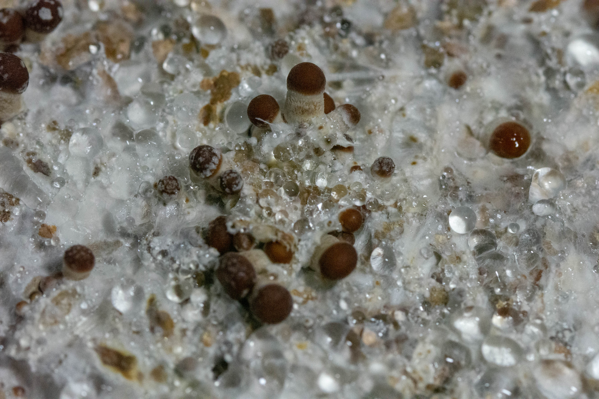
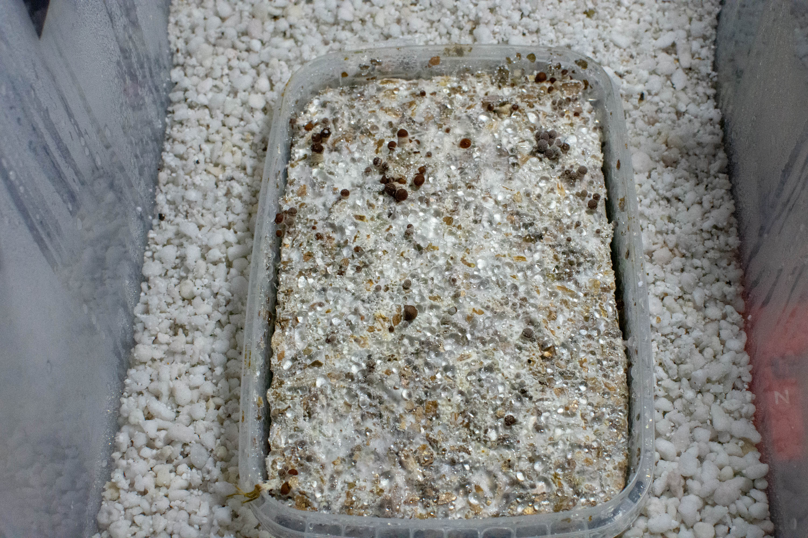
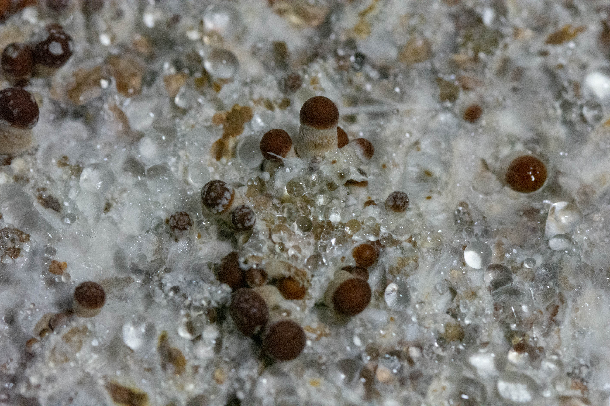

# Cubensis

Un día se me dio por experimentar con el cultivo de Setas... Investigué por varios medios la forma de obtenerlas y aprendí mucho sobre el principio activo Psilocibina. No es que yo suela ser una persona dada al consumo de sustancias, pero me pareció interesante sus propiedades de interconectar redes neuronales que normalmente no se relacionan unas con otras, sus beneficios en cuadros depresivos y sobretodo su uso utilización con fines meditativos. 

## Imagen Macro

Aquí se ve el cultivo humedecido por condensación. Por debajo hay perlita que ayuda a retener la humedad. Se ve el cuerpo fructífero inicial del hongo sobre el micelio.

Fotos de cultivo de Seta Cubensis, variante ***"Ecuatoriana"***.

